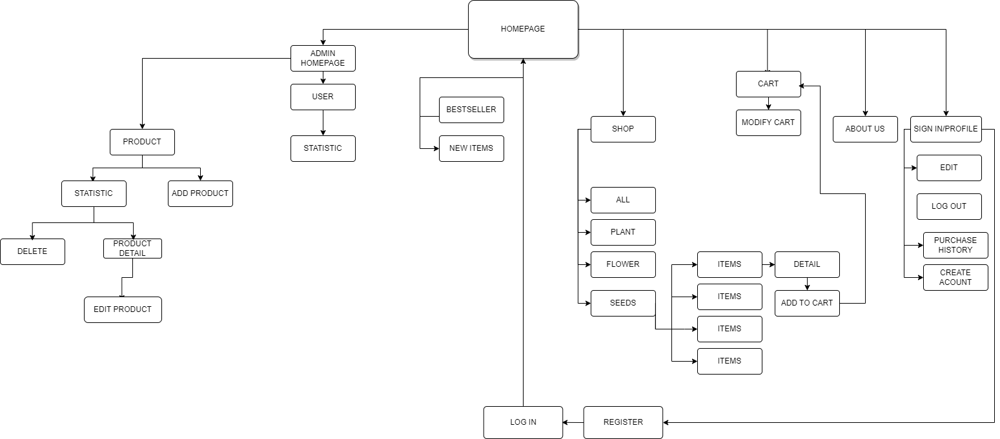
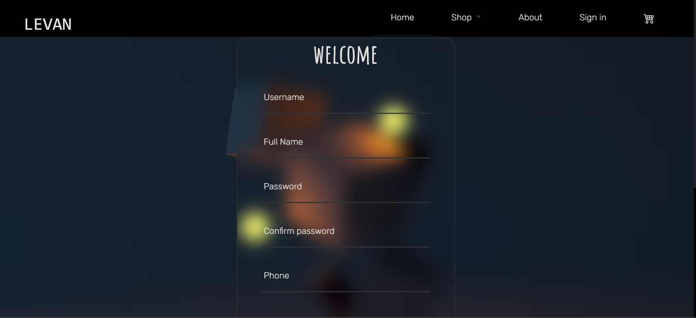

# PRJ301 PROJECT REPORT - LEVAN'S GARDENING - CQMers Team

### CQMers 
**Member**
| ***Le Thi Yen Nhi*** |
 ***Le Nguyen Tien Nhat*** |
 ***Van Anh Quan*** |

## Introduction
>“Tranquility, serenity, and beauty of nature taught me how to find happiness in life and in the silence of eternity.” - Debasish Mridha

LEVAN'S GARDENING web application project focused on selling trees online! Our goal is to provide a platform for customers to easily browse, select, and purchase a variety of trees from the comfort of their own home. With our user-friendly interface and extensive collection of trees, we aim to make the process of buying trees as simple and enjoyable as possible. Whether you're looking to add some greenery to your backyard, decorate your home with indoor plants, or gift a tree to someone special, we have you covered. Our team is dedicated to providing a seamless experience from start to finish, and we're excited to bring the joy of trees to your doorstep.  

## Requirement
### Details of the system:
- Name:  LEVAN
- Purposes:  
Provide an online shopping platform for trees, plants, and seeds.
- Customers:  
Whoever are interested in gardening, including young people and elders.
(This means that the design has to be concise, modern, and easy to interact with)
### Sitemap:

### Features:
1. FOR USER:
- Suggestions: the website will provide info of related products.
- Create new account (Sign up)
- Login/Logout
- Modify profile for more individual experience:
    - Rename (username, first name, last name)
    - Edit telephone number
    - Address for shipment
- View product's detail.
- Shopping experience:
    - Combination of search, category, sorting and pagination. Users are able to:
        - Search by keyword
        - Sorting
        - View as pages. Pagination technique was applied for enhanced website performance.
    - View:
        - Related products
        - Newest items
        - Best seller
    - Cart:
        - Add to cart/Remove from the cart/Update cart's detail.
        - Purchase items.
- View purchase history.
- The front-end is developed with Bootstrap 5.3 and Chart.js framework, which brings responsive design and enhances users' experience

2. FOR ADMIN:
- Product management:
    - Create-Read-Update-Delete.
    - Statistics: Pagination features to increase performance.
- Users management:
    - Check new registers base on time
    - Statistics: Chart for visualized data.

## Sitemap && Wireframe:
### User view:
- Sign up

- Login

- Homepage

- Shop

- Profile

- About us

- Product's detail

- Cart

- Purchase history

- Detail for each purchase made

### Admin's view
- Mainpage

- We provide CRUD features for products. This is the interface for product's creation:

- If a product is added successfully, the website navigates to a page, which is a view of a list of products (seperated by pages) to check the newly added item. 

- It's also possible to view items from mainpage.

- The admin is able to edit a product's detail, or even delete a product by a click. Below is the interface of a chosen product's detail.

- Update. (After finishing edit, the admin is navigated back to product's detail page)

- In the ProductList page, it's possible to sort data base on categories: price, added date and quantity.
- However, the pagination feature hasn't been developped successful, which eventually effects on overall performance. Also, sort descendingly feature development is in process.

## Conclusion
As we have made this far from scratch, we are looking forward to bringing this project to life and hope make it useful.
Our project has several advantages, disadvantages, and lessons learned throughout the development process.

### Advantages: 
Our web application provides a user-friendly interface and an extensive collection of trees, making it easy and convenient for customers to browse, select, and purchase trees online. This project promotes environmental sustainability by encouraging the planting of more trees, which is a positive impact on the environment. Additionally, the online platform allows customers to easily compare prices, select from a wide variety of trees, and have them delivered straight to their doorstep.

### Weaknesses: 
- Web app sercurity
- Validation(phone, address,..)
- Have no delivery feature (allow customer know that their purchases have accepted or not, know shipdate,...)
- A couple os small bugs in data (images) transfering.

### Lessons Learned: 
Through the development process, we have learned several lessons that we will carry forward to future projects. 
- Implementation of Model-View-Controller 2 design pattern.
- Plan and design an effective, concise database.
- Design user-friendly UI/UX that can be easily interactted with.
- Handle request, response correctly and effectively.
- Front-end development with Boostrap 5.2 and Chart.js framework that further enhance visual experience.
- Group working, effective communication between team members to ensure that the project is completed within the specified timeframe. 

Overall, our project has the potential to provide customers with a convenient and user-friendly online platform to purchase trees online. We have obtained valuable lessons throughout the development process and are committed to continuously improving and refining our skills - not only to meet the market's interest in the near future, but also not to limit our abilities and potentials.

